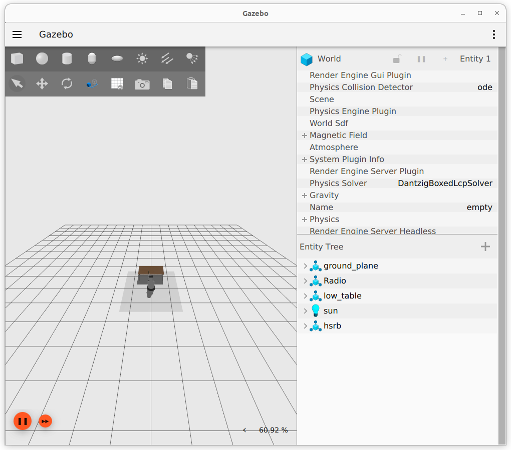
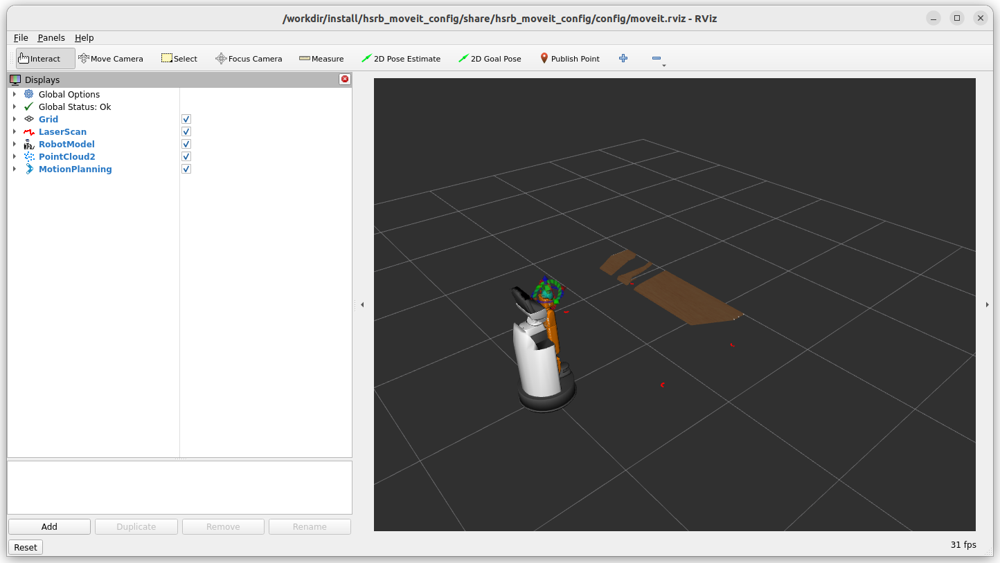
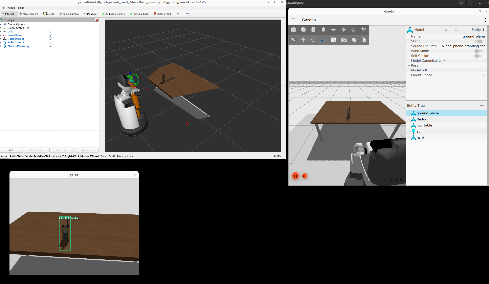
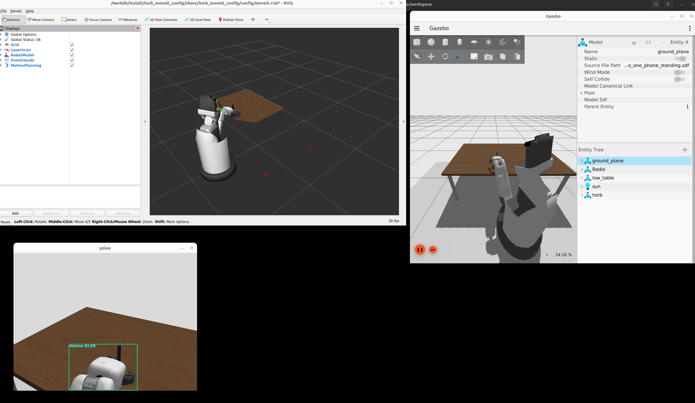
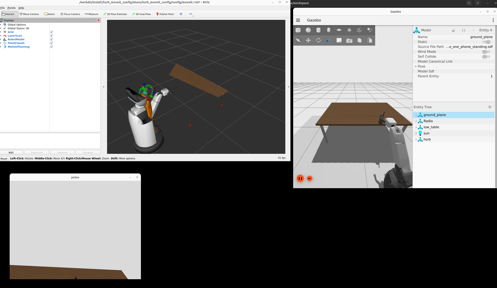
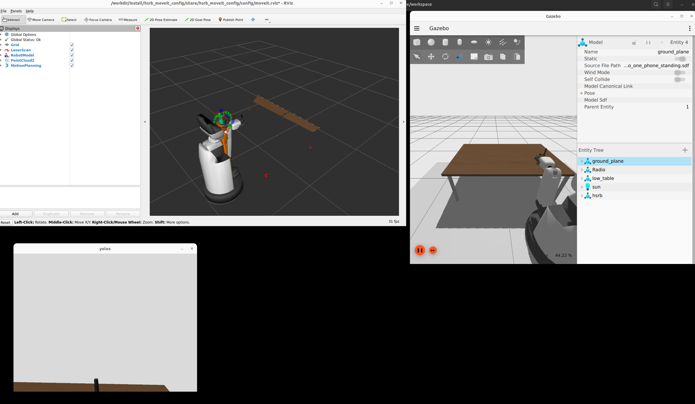

# Development of Sample Software for Pick & Place using HSR/ROS2

---
## 1. Overview

This document explains the following procedures.

* We will set up the sample software for Pick & Place using HSR/ROS2 in a Docker environment.
* In combination with separately built software that integrates yolox_ros and graspnet_ros, we will perform the following simulation operations.
  * Using yolox_ros, we will detect grasp targets within the image sequence.
    * In this process, we aimed to speed up data transmission by acquiring compressed images (topics) as input.
    * The detection results from yolox_ros are fed into graspnet_ros, which outputs the position and orientation of the grasp target.
  * By receiving the above grasp estimation results with the HSR/ROS2 software, the system performs Pick & Place operations on the target object.

---

<div style="page-break-before:always"></div>


## 2. Overview of This Workspace Configuration
The deliverables presented in this document are as follows.

### 2.1. Software Requirements
The configuration of the basic software used in the setup is as follows.

<div style="text-align: center;">
<h5>Table 1: Software Requirements</h5>
</div>

| Item                         | Content                                                                            |
| -----------------------------|------------------------------------------------------------------------------------|
| OS                           | Ubuntu 22.04        |
| ROS                          | ROS2 Humble |
| Configuration Environment    | Docker version 28.3.2, build 578ccf6                                               |
| Operational Component        | Using hsrb_interface                                                               |
| Object Recognition Module    | yolox ROS2 Implementation: https://github.com/Ar-Ray-code/YOLOX-ROS                |
| Grasp Pose Estimation Module | grasp net ROS2 node(Provided by Toyota)                                            |
| Simulator                    | Using Ignition Gazebo                                                              |
<br>

<div style="page-break-before:always"></div>

### 2.2. Package Configuration of This Pick & Place Software


```
~/pick_and_place_example
|
hsrb_pnp_ws/
|   ├── docker
|   |   ├── docker-compose.yaml
|   |   └──  Dockerfile
|   ├── src/
|       ├── hsr_repos_ignition_humble/      # Main HSR-B packages
|       │   ├── csm/                        # Scan matching library
|       │   ├── dynpick_driver/             # Force sensor driver
|       │   ├── exxx_control_table/         # Control table
|       │   ├── gazebo_ros2_control/        # Gazebo ROS 2 control
|       │   ├── graspnet_ros/               # Graspnet
|       │   ├── gz_ros2_control/            # Gazebo ignition ros2 control
|       │   ├── hsrb_common/                # Common HSR-B packages
|       │   ├── hsrb_control/               # Control packages
|       │   ├── hsrb_controllers/           # Robot controllers
|       │   ├── hsrb_drivers/               # Hardware drivers
|       │   ├── hsrb_interfaces/            # Interface definitions
|       │   ├── hsrb_launch/                # Launch files
|       │   ├── hsrb_manipulation/          # Manipulation packages
|       │   ├── hsrb_monitor/               # System monitoring
|       │   ├── hsrb_moveit/                # MoveIt integration
|       │   ├── hsrb_robot/                 # Robot description
|       │   ├── hsrb_rosnav/                # Navigation integration
|       │   ├── hsrb_simulator/             # Simulation environment
|       │   ├── hsrb_teleop/                # Teleoperation packages
|       │   ├── hsr_common/                 # Common HSR packages
|       │   ├── ros2_laser_scan_matcher/    # Laser scan matching
|       │   ├── tmc_common/                 # Common TMC packages
|       │   ├── tmc_common_msgs/            # Common message definitions
|       │   ├── tmc_database/               # Database integration
|       │   ├── tmc_dev_tools/              # Development tools
|       │   ├── tmc_drivers/                # Hardware drivers
|       │   ├── tmc_gazebo/                 # Gazebo integration
|       │   ├── tmc_manipulation/           # Manipulation libraries
|       │   ├── tmc_manipulation_base/      # Base manipulation
|       │   ├── tmc_manipulation_planner/   # Motion planning
|       │   ├── tmc_navigation/             # Navigation stack
|       │   ├── tmc_realtime_control/       # Real-time control
|       │   ├── tmc_teleop/                 # Teleoperation libraries
|       │   └── tmc_voice/                  # Voice recognition/synthesis
|       └── hsrb_pnp_okgs
|            ├── hsrb_pick_and_place/        # Pick and place functionality
|            └── hsrb_pnp_msgs/              # Pick and place msgs
```

<div style="page-break-before:always"></div>
<br>

```
~/pick_and_place_example
|
|  -------- See separate document (yolox_ws/doc/README-EN.md) for details. -------------------------------------------------
└── yolox_ws
|   ├── check_grasp_result.sh           # Check script for graspnet's results
|   ├── play_movie.sh                   # Sample image scequence playing script for test
|   ├── start_yolox_graspnet_ros.sh     # Start script for yolox and graspnet
|   ├── docker
|   │   ├── docker-compose.yaml
|   │   ├── Dockerfile
|   │   └── ros_entrypoint.sh
|   ├── Images
|   │   └── rosbag2_one_phone_standing_up.zip
|   ├── Doc
|   │   ├── README.md
|   │   └── result_yolox_graspnet.jpg
|   ├── src
|       ├── compressed_rgbd_msgs
|       ├── coordinate_transform_util_ros
|       ├── cv_bridge_util
|       ├── graspnetAPI
|       ├── graspnet-baseline
|       ├── graspnet_ros
|       ├── instance_segmentation_msgs
|       ├── yolox_bridge
|       ├── yolox_graspnet_meta
|       └── YOLOX-ROS
```


<br><br>

## 3. Environment Setup Procedure

Please execute the following to start the Docker container.

* Starting the HSR/ROS2 Pick & Place Container

``` bash
$ cd /path/to/pick_and_place_example/hsrb_pnp_ws/docker
$ docker compose up -d
```

* Starting the yolox + graspnet Container

``` bash
$ cd /path/to/pick_and_place_example/yolox_ws/docker
$ docker compose up -d
```

## 4. Procedure for Pick & Place Operation of Detected Objects in Simulation

### 4.1. Generating the Base HSRB System and Simulation World

On terminal 1, please execute the following.

```bash
$ xhost +
$ docker exec -it hsrb_pick_and_place bash
hsrb@computer:~/ros2_ws$ ./launch_hsrb_pnp_ignition_gz.sh
```


As a result, the following Ignition Gazebo and RViz will start.

<div style="display: flex;">
  
  
</div>
<br>

### 4.2. Starting the Container for Object Detection and Grasp Pose Estimation (yolox + graspnet)

On terminal 2, please execute the following.

``` bash
$ docker exec -it yolox_ros_onnx_graspnet bash
root@computer:~/ros2_ws# cd /workdir
root@computer:/workdir# source ./install/setup.bash
root@computer:/workdir# ~/ros2_ws/start_yolox_graspnet_ros.sh
```


### 4.3. Starting the HSRB Pick & Place Control System

On terminal 3, please execute the following.
```bash
$ docker exec -it hsrb_pick_and_place bash
hsrb@computer:~/ros2_ws# ./start_hsrb_pick_and_place.sh
```


### 4.4. Executing the command to point the robot’s camera at the target object

On terminal 4, please execute the following.
Here, the parameter given as "{pos: [0.5, 0.12, 0.75]}" represents the 3D coordinates in the world coordinate system of the robot’s base_link, with the unit being meters.

```bash
$ docker exec -it hsrb_pick_and_place bash
hsrb@computer:~/ros2_ws$ ./trigger_gaze.sh
```

As a result, the HSR captures the target object within its field of view as follows.




### 4.5. Executing the command to make the robot perform Pick & Place

On terminal 4, please execute the following.
Here, the parameter given as "{pos: [0.6, -0.28, 0.608]}" represents the 3D coordinates of the Place position in the world coordinate system, with the unit being meters.
By default, the orientation of the Place position is the same as that of the Pick position. However, you can change the default orientation of the Pick position by specifying an additional three-dimensional parameter in radians following the aforementioned position parameter.
Example "{pos: [0.6, -0.28, 0.608, 0.175, 0.0, 0.0]}"

⚠️WARNING⚠️: Here, it is assumed that the target object is within the robot’s field of view so that it can be recognized and grasped by graspnet.


```bash
$ docker exec -it hsrb_pick_and_place bash
hsrb@computer:~/ros2_ws$ ./trigger_pnp.sh
```

Based on the above results, the HSR will perform the following actions.

* It approaches the target object, opens the gripper, then closes the gripper to grasp the object.

<br><br>


* It moves to the right, places the object, and…


<br><br>

* It opens the gripper and raises the hand.



## 5. Starting the auxiliary command
### 5.1. Executing the command to return the robot’s arm to the home position

``` bash
$ docker exec -it hsrb_pick_and_place bash
hsrb@computer:~/ros2_ws$ cd /workdir
# In a new Terminal 5
hsrb@computer:~/workdir$ source install/setup.bash
# Arm Reset trigger
hsrb@computer:~/workdir$ ros2 service call /arm_reset_trigger std_srvs/srv/Trigger "{}"
```

### 5.2. Turning ON/OFF the automatic setting for grasping the object from the nearest side with the arm
The output from graspnet may not always suggest an orientation that is nearly aligned with the robot’s current position.
In such cases, this application implements a function that allows the robot to grasp with an orientation symmetrical to the proposed one, closer to the robot. The following section explains how to toggle this function on and off.

* Function ON (default)

``` bash
# In a new Terminal 6
$ docker exec -it hsrb_pick_and_place bash
hsrb@computer:~/ros2_ws$ cd /workdir
hsrb@computer:~/workdir$ source install/setup.bash
hsrb@computer:~/workdir$ ros2 service call /graspnet_pose_adjust std_srvs/srv/SetBool "{data: true}"
```

* Function OFF

``` bash
# In a new Terminal 6
$ docker exec -it hsrb_pick_and_place bash
hsrb@computer:~/ros2_ws$ cd /workdir
hsrb@computer:~/workdir$ source install/setup.bash
hsrb@computer:~/workdir$ ros2 service call /graspnet_pose_adjust std_srvs/srv/SetBool "{data: false}"
```

## 6. Operation Method on the Actual Machine

Configure cyclonedds to enable communication with the robot.

On the HSR’s internal PC, configure the `/etc/opt/tmc/robot/cyclonedds_profile.xml` file.

The template for the file is as follows.

* In line 4, please remove NetworkInterfaceAddress for HSR-C.
* For the Peer Address, set the IP address of the PC that will communicate with the robot (hereafter referred to as the remote PC).

```bash
<CycloneDDS>
  <Domain>
    <General>
      <NetworkInterfaceAddress>wlp3s0</NetworkInterfaceAddress>
      <AllowMulticast>false</AllowMulticast>
      <EnableMulticastLoopback>false</EnableMulticastLoopback>
      <MaxMessageSize>65500B</MaxMessageSize>
    </General>
    <Discovery>
      <ParticipantIndex>auto</ParticipantIndex>
      <MaxAutoParticipantIndex>100</MaxAutoParticipantIndex>
      <Peers>
        <Peer Address="xxx.xxx.xxx.xxx"/>
        <Peer Address="localhost"/>
      </Peers>
    </Discovery>
  </Domain>
</CycloneDDS>
```

Next, configure cyclonedds on the remote PC.

First, configure the following two files.

* yolox_ws/docker/cyclonedds_profile.xml
* hsrb_pnp_ws/docker/cyclonedds_profile.xml

The template for the file is as follows.

* For the Peer Address, set the IP address of the HSR with which you will communicate.

```bash
<CycloneDDS>
  <Domain>
    <General>
      <AllowMulticast>false</AllowMulticast>
      <EnableMulticastLoopback>false</EnableMulticastLoopback>
      <MaxMessageSize>65500B</MaxMessageSize>
    </General>
    <Discovery>
      <ParticipantIndex>auto</ParticipantIndex>
      <MaxAutoParticipantIndex>100</MaxAutoParticipantIndex>
      <Peers>
        <Peer Address="xxx.xxx.xxx.xxx"/>
        <Peer Address="localhost"/>
      </Peers>
    </Discovery>
  </Domain>
</CycloneDDS>
```

Next, configure the following file.

* yolox_ws/docker/docker-compose.yaml

Make the following changes, and set the ROS_DOMAIN_ID according to your environment.

```bash
#version: '3.4'
services:
    yolox_ros_onnx_graspnet:
        container_name: yolox_ros_onnx_graspnet
        privileged: true
        build:
            # context: .
            context: ..
            dockerfile: docker/Dockerfile
            args:
                - BASE_TAG=11.8.0-cudnn8-devel-ubuntu22.04
        image: yolox_ros_onnx_graspnet:latest
        network_mode: host
        runtime: nvidia
        environment:
            - DISPLAY=$DISPLAY
            - RMW_IMPLEMENTATION=rmw_cyclonedds_cpp
            - CYCLONEDDS_URI=file:///root/ros2_ws/docker/cyclonedds_profile.xml
            - ROS_DOMAIN_ID=XXX
            - TZ=Asia/Tokyo
        volumes:
            - ../:/root/ros2_ws
            - /tmp/.X11-unix:/tmp/.X11-unix
        devices:
            - "/dev/video0:/dev/video0"
        working_dir: /root/ros2_ws
        tty: true
        command: bash
```

* hsrb_pnp_ws/docker/docker-compose.yaml

Similarly, set the ROS_DOMAIN_ID according to your environment.

```bash
services:
    hsrb_pick_and_place:
        container_name: hsrb_pick_and_place
        privileged: true
        build:
            context: ..
            dockerfile: docker/Dockerfile   # added
        image: hsrb_pick_and_place:latest
        network_mode: host
        runtime: nvidia
        environment:
            - DISPLAY=$DISPLAY
            - RMW_IMPLEMENTATION=rmw_cyclonedds_cpp
            - CYCLONEDDS_URI=file:///home/hsrb/ros2_ws/docker/cyclonedds_profile.xml
            - ROS_DOMAIN_ID=XXX
            - IGN_GAZEBO_RESOURCE_PATH=/workdir/src/hsrb_pnp_pkgs/hsrb_pick_and_place/models/
        volumes:
            - ../:/home/hsrb/ros2_ws
            - /tmp/.X11-unix:/tmp/.X11-unix
        devices:
            - "/dev/video0:/dev/video0"
        working_dir: /home/hsrb/ros2_ws
        tty: true
        command: bash
```

For the actual machine, modify the parameters and topic names.

* yolox_ws/start_yolox_graspnet_ros.sh

```bash
#! /bin/bash

source ./install/setup.bash
ros2 launch yolox_ros_launch yolox_onnxruntime_without_camera.launch.py src_image_topic_name:=/head_rgbd_sensor/rgb/image_rect_color &
# ros2 launch yolox_bridge yolox_bridge.launch.py depth_topic:=/head_rgbd_sensor/image/compressedDepth  &
ros2 launch yolox_bridge yolox_bridge.launch.py depth_topic:=/head_rgbd_sensor/depth_registered/image_rect_raw/compressedDepth &
ros2 launch graspnet_ros_launch grasp_detector.launch.py input_topic:=/yolox_bridge/result &
```

* hsrb_pnp_ws/start_hsrb_pick_and_place.sh

```bash
#! /bin/bash

# Run the pick and place system
# cd /workdir; source ./install/setup.bash ; ros2 run hsrb_pick_and_place hsrb_pick_and_place --ros-args -p use_sim_time:=True
cd /workdir; source ./install/setup.bash ; ros2 run hsrb_pick_and_place hsrb_pick_and_place --ros-args -p world_frame_id:=map -p use_sim_time:=False
```

Once the configuration is complete, recreate the container.

Execute the following to build.

```bash
$ cd /path/to/pick_and_place_example/yolox_ws/docker
$ docker compose build

$ cd /path/to/pick_and_place_example/hsrb_pnp_ws/docker
$ docker compose build
```

After the build is complete, start the container.

```bash
$ cd /path/to/pick_and_place_example/hsrb_pnp_ws/docker
$ docker compose up -d

$ cd /path/to/pick_and_place_example/yolox_ws/docker
$ docker compose up -d
```


After releasing the emergency stop and confirming that the HSR has started, execute the following on terminal 1 (remote PC).

```bash
$ xhost +
$ docker exec -it yolox_ros_onnx_graspnet bash
$ cd /workdir
$ source ./install/setup.bash
$ ~/ros2_ws/start_yolox_graspnet_ros.sh
```

On terminal 2 (remote PC), please execute the following.

```bash
$ docker exec -it hsrb_pick_and_place bash
$ ./start_hsrb_pick_and_place.sh
```

On terminal 3 (remote PC), please execute the following.

```bash
$ docker exec -it hsrb_pick_and_place bash
$ ./trigger_gaze.sh
```

Adjust the `pos` in `hsrb_pnp_ws/trigger_gaze.sh` as needed to ensure the target object is within the field of view.

The parameter given as `"{pos: [0.5, 0.12, 0.75]}"` represents the 3D coordinates in the world coordinate system of the robot’s base_link, with the unit in meters.


On terminal 4 (remote PC), please execute the following.

```bash
$ docker exec -it hsrb_pick_and_place bash
$ ./trigger_pnp.sh
```

Adjust the `pos` in `hsrb_pnp_ws/trigger_pnp.sh` as needed to specify the location where the object should be placed after grasping.

The parameter given as `"{pos: [0.6, -0.28, 0.608]}"` represents the 3D coordinates of the Place position in the world coordinate system, with the unit in meters.

By default, the orientation of the Place position is the same as that of the Pick position. However, you can change the default orientation of the Pick position by specifying an additional three-dimensional parameter in radians following the aforementioned position parameter.

Example `"{pos: [0.6, -0.28, 0.608, 0.175, 0.0, 0.0]}"`

⚠️WARNING⚠️: Here, it is assumed that the target object is within the robot’s field of view so that it can be recognized and grasped by graspnet. If multiple objects are within the field of view, or if the target object is too small, the system may not operate properly.


If the system does not operate properly, adjust the parameters in the following file or modify the position of the target object as needed.

* /path/to/pick_and_place_example/hsrb_pnp_ws/src/hsr_repos_ignition_humble/graspnet_ros/graspnet_ros_node/graspnet_ros_node/parameters.yaml

Parameters to Adjust

* robustness_th　：　- Threshold for the safety (robustness) score of grasp candidates. Increasing this value will leave only candidates in stable positions.
* workspace_outlier　：　- Threshold for determining whether the object’s position is outside the workspace. Narrowing the allowable range will result in fewer candidates.


<div style="text-align: right;">
End
</div>