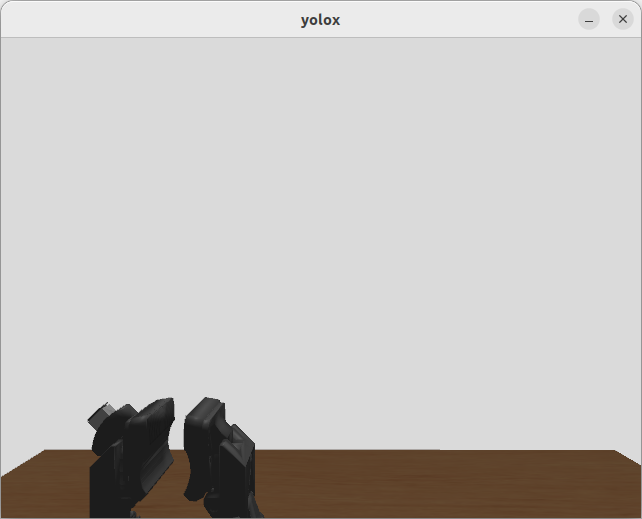
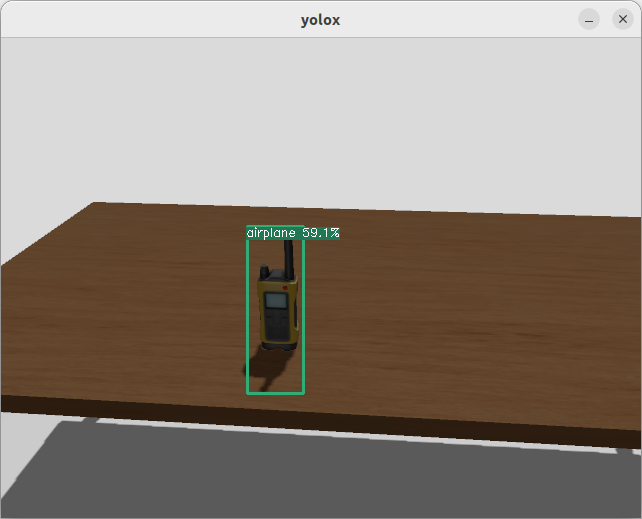

# Configuration Method for Object Recognition + Grasp Pose Estimation Simulation Sample


## 1. Overview
This document explains the following procedures.

* We will build sample software that integrates yolox_ros and graspnet_ros within a Docker environment.
* Within the above Docker environment, the following simulation operations will be performed.
  * Using yolox_ros, detect grasp target objects within the image sequence.
    * In this process, data transmission speed was improved by acquiring compressed images (topics) as input.
  * The detection results from yolox_ros are provided to graspnet_ros, which outputs the position and orientation of the grasp target object.

---

## 2. Overview of This Workspace Configuration
The deliverables presented in this document are as follows.

### 2.1. Software Requirements
The configuration of the basic software used in this setup is as follows.

<div style="text-align: center;">
<h5>Table 1: Software Requirements</h5>
</div>

| Item                         | Content                                                                            |
| -----------------------------|------------------------------------------------------------------------------------|
| OS                           | Ubuntu 22.04        |
| ROS                          | ROS2 Humble |
| Configuration Environment    | Docker version 28.3.2, build 578ccf6                                               |
| Operational Component        | Using hsrb_interface                                                               |
| Object Recognition Module    | yolox ROS2 Implementation: https://github.com/Ar-Ray-code/YOLOX-ROS                |
| Grasp Pose Estimation Module | grasp net ROS2 node(Provided by Toyota)                                            |
| Simulator                    | Using Ignition Gazebo                                                              |

<br><br>

### 2.2. Directory Structure
This software consists of the following directory structure and is intended to be executed within a Docker environment.

```
/path/to/workspace
├── Additional_src
│   ├── Dependent_package_src.zip
│   └── Graspnet_ros_src.zip
└── yolox_ws
    ├── check_grasp_result.sh
    ├── play_movie.sh
    ├── test_yolox_graspnet_ros.sh
    ├── docker
    │   ├── docker-compose.yaml
    │   ├── Dockerfile
    │   └── ros_entrypoint.sh
    ├── doc
    │   ├── README.md
    │   └── result_yolox_graspnet.jpg
    ├── src
        ├── compressed_rgbd_msgs
        ├── coordinate_transform_util_ros
        ├── cv_bridge_util
        ├── graspnetAPI
        ├── graspnet-baseline
        ├── graspnet_ros
        ├── instance_segmentation_msgs
        ├── yolox_bridge
        ├── yolox_graspnet_meta
        └── YOLOX-ROS

```


## 3. Environment Setup Procedure on the Host Side
Please follow the steps below to build the Docker container that will serve as the host environment.

### 3.1. Allowing GUI Window Display from within the Docker Container

``` bash
$ xhost +
```

### 3.2. Starting the Container

``` bash
$ cd /path/to/pick_and_place_example/yolox_ws/docker
$ docker compose up -d
```

<br><br>

---
<div style="page-break-before:always"></div>

## 4. Executing Grasp Pose Estimation with graspnet_ros

### 4.1. Starting the simulator with hsrb_pick_and_place
In the ROS2 commands executed in the following sections, some will not function properly unless the simulator is running. Therefore, in separate terminals, start the simulator using hsrb_pick_and_place.

Starting the HSR/ROS2 Pick & Place Container

``` bash
$ cd /path/to/pick_and_place_example/hsrb_pnp_ws/docker
$ docker compose up -d

#Terminal 1
$ docker exec -it hsrb_pick_and_place bash
root@computer:~/ros2_ws# ./launch_hsrb_pnp_ignition_gz.sh

#Terminal 2
$ docker exec -it hsrb_pick_and_place bash
hsrb@computer:~/ros2_ws# ./start_hsrb_pick_and_place.sh

#Terminal 3
$ docker exec -it hsrb_pick_and_place bash
root@computer:~/ros2_ws# ./trigger_gaze.sh
```

### 4.3. Starting yolox_ros and graspnet_ros
By starting the following from a separate terminal, you can launch the object detection process using yolox_ros and the grasp pose estimation process using graspnet_ros. These processes cannot be stopped unless a stop command is executed.

- Start Command

``` bash
$ docker exec -it yolox_ros_onnx_graspnet bash
root@computer:~/ros2_ws# cd /workdir
root@computer:~/workdir# ~/ros2_ws/start_yolox_graspnet_ros.sh
```
If neither of the displays shown below appears when the above is executed, the process has failed. Please restart from “3. Environment Setup Procedure on the Host Side.”

- Stop Command

``` bash
$ docker exec -it yolox_ros_onnx_graspnet bash
root@computer:~/ros2_ws# cd /workdir
root@computer:~/ros2_ws# ~/ros2_ws/stop_yolox_graspnet_ros.sh
```
<div style="display: flex;">
  
  
</div>

## 5. Operation on the Actual Machine

Please refer to hsrb_pnp_ws/Docs/README-EN.md.

# 6. Supplement
## Video Input via rosbag
You can play a rosbag containing HSR topics.
In the following, it is assumed that the sample rosbag data (rosbag2_one_phone_standing_up) is stored under ~/Images/. If the file is not present when executed, an error will occur.

``` bash
$ docker exec -it yolox_ros_onnx_graspnet bash
root@computer:~/ros2_ws# ros2 bag play ./Images/rosbag2_one_phone_standing_up
```

<div style="text-align: right;">
End
</div>
